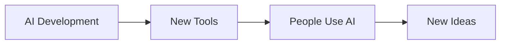

# AI Event# AI Event

## Date
September 17, 2026

## About This Event
Artificial intelligence continues to change how people work, learn, and communicate. New AI tools are being developed for education, business, and everyday life.

## Key Points
- AI is being used in education.
- AI tools can help people complete tasks.
- Governments and organizations are discussing responsible AI use.

## AI Event Flow

    ## Learn More

- [Global Event](global-event.md)
- [README](README.md)
